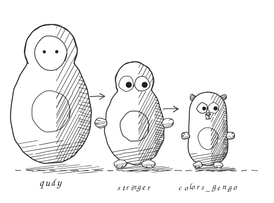
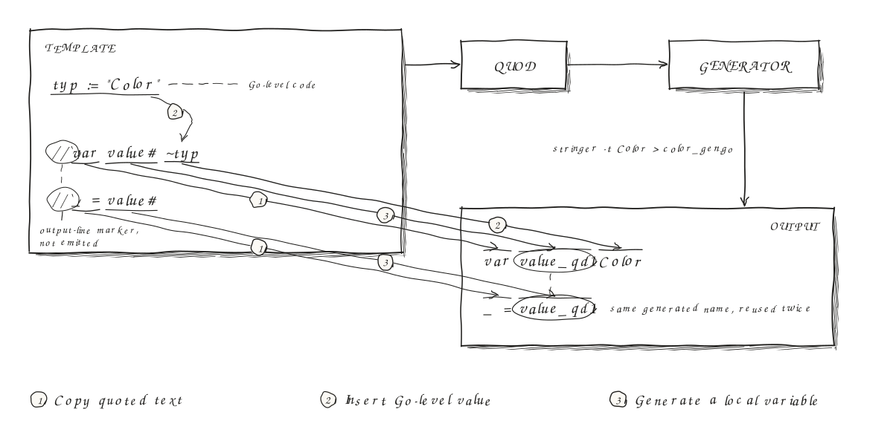

# qudy

qudy is a Go library and command for writing Go code generators. Keep loops,
conditions, and helper calls in Go, and write the source you want to produce in
comments next to that logic. qudy compiles those comments into calls to a
printf-style function.

If you have written a generator full of escaped strings, the difference looks
like this. Given `names := []string{"Red", "Green", "Blue"}`, a template can say:

```go
for _, name := range names {
    //`case ~name:
    //`    return "~name"
}
```

Running the resulting generator writes:

```go
case Red:
    return "Red"
case Green:
    return "Green"
case Blue:
    return "Blue"
```

The loop is ordinary Go. The comments describe the output, and `~name` inserts
the current value.

Use it when your generator mixes Go logic with repetitive source code: methods
for a set of types, handlers for a list of routes, or boilerplate derived from a
schema. The template keeps the output visible beside the logic that produces it,
without a separate language for loops and expressions.

There are two steps: **qudy compiles your template into a Go generator; you run
that generator to write the final source.** You supply the data and the logic
that reads it. The generator contains ordinary Go calls and needs no qudy
runtime dependency.



The example below takes an enum's constant names as arguments. After that, read
about interpolation, integration with existing generators, and writing several
files.

## A stringer in one file

Suppose you want `fmt.Sprint(Green)` to print `Green` rather than `1`. In an
existing Go module, save this enum as `color.go`:

```go
// color.go
package colors

type Color int

const (
    Red Color = iota
    Green
    Blue
)
```

The template below generates its `String` method. It takes the package, type,
and constant names from the command line; it does not discover them in Go
source. Create a `stringer` directory and save this as `stringer/stringer.go`:

```go
//go:build qudy

package main

import "os"

func main() {
    pkg, typ, names := os.Args[1], os.Args[2], os.Args[3:]
    //`package ~pkg
    //`
    //`import "fmt"
    //`
    //`func (v# ~typ) String() string {
    //`	switch v# {
    for _, name := range names {
        //`	case ~name:
        //`		return "~name"
    }
    //`	}
    //`	return fmt.Sprintf("~typ(%d)", v#)
    //`}
}
```

The Go code runs in the generator. Each comment that starts with a backtick
writes an **output line**, `~name` inserts a Go value, and the loop writes one
`case` for each constant. `v#` writes a generated name, something like `v_qd1`,
to reduce the chance of clashing with names in the generated code. See
[generated names](#generate-names-with-fewer-collisions) for the limits.

See [examples/stringer](examples/stringer) for a slightly longer version.

## Run the example

Install the command with Go 1.25 or later:

```sh
go install github.com/bilus/qudy/cmd/qudy@latest
```

First, compile the template into a Go program:

```sh
qudy -o stringer/stringer_gen.go stringer/stringer.go
```

Then run that program to generate the method:

```sh
go run ./stringer colors Color Red Green Blue > color_string_gen.go
```

`color_string_gen.go` now holds:

```go
package colors

import "fmt"

func (v_qd1 Color) String() string {
	switch v_qd1 {
	case Red:
		return "Red"
	case Green:
		return "Green"
	case Blue:
		return "Blue"
	}
	return fmt.Sprintf("Color(%d)", v_qd1)
}
```

Run `go test ./...` to check that the package builds with its new method.

## How the template becomes a generator

qudy turns the template's two output lines inside the loop into a call
equivalent to:

```go
fmt.Printf("\tcase %v:\n\t\treturn \"%v\"\n", name, name)
```

The `-emit` flag chooses that function. It defaults to `fmt.Printf`. and qudy
adds the `fmt` import to the generator when the template lacks it. You can use
an existing generator's method to write to a buffer or file. qudy combines a
**run** of consecutive output lines into one call, uses `%v` for inserted values,
and escapes literal percent signs, which is why the template can say `%d`.
Your emit function must accept a format string and its arguments and interpret
them like `fmt.Printf`.

## Build tags and editor support

A template parses as Go, so `gofmt` can format it and your editor can read it.
It may not build as Go: variables used only in output lines look unused to the
Go compiler. So start a template with `//go:build qudy`, and a normal build
ignores it. qudy writes `//go:build !qudy` into the generator, so the two never
build together. Name generated Go files with the `_gen.go` suffix. For a
compiled template, replace `.go` with `_gen.go`: `stringer.go` becomes
`stringer_gen.go`. The CLI writes to the path supplied with `-o`.

To get completion and navigation inside a template, give your editor the tag,
for example `-tags=qudy` in the `buildFlags` of gopls. It then loads the
templates in place of the generators, and it reports a name that only output
lines use as unused.

The quick start runs qudy by hand. To run it with `go generate`, see
[examples/stringer](examples/stringer).

## Insert values into the output

Output lines combine literal text, values inserted with `~`, and names generated
with `#`:



`~name` is an **interpolation**: qudy inserts the value of `name` there.
For example, inside a template function:

```go
foo := "XXX"
count := 3
//`~foo
//`~count
```

Produces:

```text
XXX
3
```

qudy formats each inserted value with `%v`, so numbers need no conversion.
You can also capture a selector:

```go
p := struct{ Name string }{Name: "Color"}
//`type ~p.Name int
```

Produces:

```text
type Color int
```

Without braces, `~` captures the next Go identifier and any selectors that
follow it, as in `~p.Name`. Each identifier must use only ASCII letters, digits,
and underscores, and cannot start with a digit.

Use a **braced interpolation**, `~{expr}`, to capture a call, index, or other Go
expression. This example uses `strconv.Quote` from the standard library:

```go
label := "hello"
values := []int{10, 20}
//`var label = ~{strconv.Quote(label)}
//`var first = ~{values[0]}
```

Produces:

```text
var label = "hello"
var first = 10
```

Without braces, capture stops before a bracket or parenthesis. Compare:

```go
name := "items"
//`~name[0]
//`~{name[0]}
```

Produces:

```text
items[0]
105
```

`~name[0]` captures only `name`, inserting its value followed by the literal
text `[0]`. `~{name[0]}` evaluates the index in the generator: the first byte of
`"items"` is `'i'`, whose numeric value is 105. This distinction lets you write
indexing and calls in the generated code as well as evaluate them in the
generator.

### Insert a Go string literal

`~"name` inserts a value as a Go string literal, with its quotes and every
escape it needs:

```go
path := `C:\temp`
//`var quoted = ~"path
//`var naive = "~path"
```

Produces:

```text
var quoted = "C:\\temp"
var naive = "C:\temp"
```

The two lines differ, and only the first is right. `"~path"` puts the raw value
between two literal quotes, so the Go compiler reads the value again as source
text. Here it reads `\t` as a tab, and the generated program compiles with the
wrong string. A quote or a newline in the value breaks the literal, and then the
generated code does not compile at all. `~"path` escapes the value, so the
literal always holds the string you inserted. Keep `"~name"` for a value that
needs no escaping, such as a Go identifier.

`~"{expr}` takes any expression. qudy formats the value with `%v` first, so
`~"count` writes `"3"`.

### Insert a list

`~@xs` splices a slice: it inserts the elements with `, ` between them. `~@"xs`
writes each element as a Go string literal:

```go
params := []string{"a int", "b string"}
tags := []string{"<p>", `say "hi"`}
//`func f(~@params) {}
//`var tags = []string{~@"tags}
```

Produces:

```text
func f(a int, b string) {}
var tags = []string{"<p>", "say \"hi\""}
```

An empty slice inserts nothing, and `~@{expr}` takes any expression. For another
separator, join the elements yourself, as in `~{strings.Join(xs, " | ")}`.

## Output lines and comments

An output line must be a comment on its own line inside a function body.
Both `` //`text `` and the spelling that `gofmt` produces, `` // `text ``, work.
qudy copies the template's other Go code into the generator, with three
exceptions: it negates the `qudy` build tag, it leaves out `go:generate` lines,
and it handles gensyms as described below. It formats the generator with
`go/format`.

Each output line writes a trailing newline. End it with a backslash to continue
on the same line, for example when a loop writes an argument list:

```go
//`handle(ctx\
for _, arg := range args {
    //`, ~arg\
}
//`)
```

Two trailing backslashes write one backslash and keep the newline.

To put a comment in the generated code, include it in an output line:

```go
//`// Event represents a change to a user.
```

To annotate only the template, use an ordinary Go comment or `~//` inside an
output line. qudy drops `~//`, the rest of that line, and the spaces before it:

```go
//`} ~// close the generated handler
```

Write `~~` for a literal tilde and `##` for a literal hash. Reserve comments that
open with a backtick for output lines; qudy rejects them outside function bodies.

## Generate names with fewer collisions

A generator often needs its own local names in the code it produces. Write
`name#` to request a name with a numbered suffix, often called a **gensym**:

```go
//`value, errName# := parse(input)
//`if errName# != nil {
//`    return errName#
//`}
```

The first use of `errName#` in a block declares a variable in the generator,
equivalent to `errName_qd := qudyGensym("errName")`. Later uses in that block insert
the same name.

`errName#` never collides with a variable of the template. qudy keeps the
gensym in a generator variable of its own, `errName_qd`, so `errName#` and
`~errName` can stand in one output line and mean different things. For the same
reason a template may not declare a name that ends in `_qd`.

`name#` belongs in output lines. When the template's Go code needs the gensym,
call `qudyGensym`, as shown below.

qudy supplies the symbol generator. It declares `qudyGensym`, a small function
value, at the start of each function that uses `name#` or calls `qudyGensym`, so
the generator stays one self-contained file. Each gensym gets a numbered suffix, so `errName#` comes
out as `errName_qd1`, which is unlikely to collide with a name in your code.

The default generator does not inspect the output's scope or reserve existing
identifiers. A user-defined `errName_qd1` can still collide with its result.
If your generator knows which names are taken, supply a custom symbol generator
that checks them.

To choose the names yourself, declare `qudyGensym` in the template, as a local
variable, a parameter, or a package-level variable. It is a
`func(want string) string`. qudy then uses yours and declares none:

```go
qudyGensym := newSeededGensym(taken)
```

A function literal shares the symbol generator of the function around it.

Call `qudyGensym(want)` directly inside a function body when you compute the
desired name or need to declare the variable yourself:

```go
local := qudyGensym(param.Name)
//`var ~local ~param.Type.Text
```

## Generate several files

Have your generator print a txtar archive: a line such as `-- color_string_gen.go --`
starts a new file. Inside a template function, file markers are ordinary output
lines:

```go
//`-- color_string_gen.go --
//`package colors
//`// String methods go here.
//`-- color_parse_gen.go --
//`package colors
//`// Parse functions go here.
```

Pipe the generator's output into `qudy -txtar -o ./generated`. qudy splits the
archive into files under that directory and formats the `.go` files with
`go/format`. For a complete example, run this from the qudy repository:

```sh
go run ./examples/enums -package colors Color=Red,Green,Blue | qudy -txtar -o ./generated
```

See [examples/enums](examples/enums) for a generator that writes both `String`
methods and `Parse` functions. The generated methods expect the enum types and
constants to be defined in the same package.

## Extend a generator with a runtime file

By default a generator is self-contained: the generator file holds all of its
code. Pass `-runtime`, and qudy also writes `qudy_runtime.go` beside the
generator. That file is a small runtime for the package, and every template of
the package shares it. Compile all templates of a package with `-runtime`, or
none of them.

```sh
qudy -runtime -o stringer/stringer_gen.go stringer/stringer.go
```

The runtime adds two things.

### One symbol generator for the package

Without the runtime, every function counts its own gensyms. Two functions that
write into the same generated function can then both produce `err_qd1`. With
the runtime, one symbol generator counts for the whole run of the generator, so
each gensym differs from every other one: `err_qd1`, `err_qd2`, and so on.
`name#` and calls of `qudyGensym` need no change. With the runtime, such a call
may also stand outside a function body.

Two limits remain. A gensym can still collide with a name of your own in the
output, such as a hand-written `err_qd1`. The numbers also follow the order of
the whole run, so a new gensym early in the run renumbers the later ones.

### Capture and redirect the output

`qudyCapture` runs a function and returns the text of its output lines as a
string. Nothing reaches the output:

```go
func path(segments []string) string {
    return qudyCapture(func() {
        for _, s := range segments {
            //`~s/\
        }
    })
}
```

`path([]string{"usr", "bin"})` returns `usr/bin/`. A capture also takes the
output lines of every function that runs inside it, and captures nest.

More generally, `qudyEmit` is a variable of the package. While it holds a
function, every run of output lines goes to that function, in place of the
`-emit` function. `qudyPush` sets it and returns the call that restores the
previous value, which suits `defer`:

```go
func path(segments []string) string {
    var b strings.Builder
    defer qudyPush(func(format string, args ...any) { fmt.Fprintf(&b, format, args...) })()
    for _, s := range segments {
        segment(s)
    }
    return b.String()
}
```

Both work with any emit function, a method such as `g.generate` included.

The runtime file declares `qudyGensym`, `qudyCapture` and `qudyPush` as
ordinary functions, so an editor with the `qudy` tag resolves them in a
template.

### What it costs

- The generator is no longer one self-contained file. `go run stringer_gen.go`
  on that file alone fails, and `go run ./stringer` works.
- The runtime file comes from the most recent qudy compile. After an upgrade of
  qudy, compile every template of the package again.
- `qudyEmit` and the symbol generator are variables of the package. Two
  generators that run at the same time in one process share them, so keep the
  runtime away from concurrent generation.

## Use qudy as a library

Call `qudy.Compile` when you want to compile templates from your own Go program:

```go
generator, err := qudy.Compile("stringer/stringer.go", src, "fmt.Printf")
```

Import `github.com/bilus/qudy` and pass the template as `src []byte`.
`Compile` returns the generator's formatted Go source and an error. It does not
run the generator.

## Further examples

- [stringer](examples/stringer): a complete enum generator and `go generate` integration.
- [enums](examples/enums): several output files from one template.
- [sumtype](examples/sumtype): a larger generator that reads Go source.

The name stands for “quick and dirty quasiquoting”: quote the code you want to
produce, and insert Go values where it varies.
